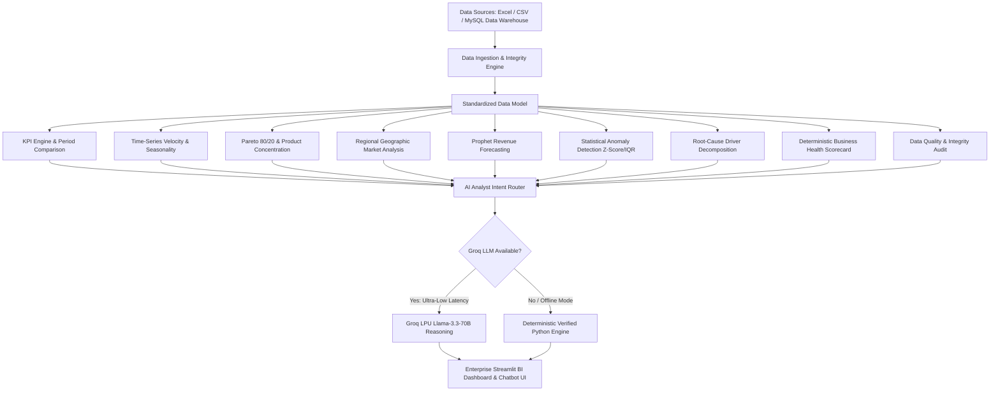

# 🚀 InsightIQ — AI Business Intelligence & Decision Intelligence Platform

[](https://www.python.org/)
[](https://streamlit.io/)
[](https://plotly.com/)
[](https://groq.com/)
[](https://facebook.github.io/prophet/)
[](LICENSE)

**InsightIQ** is an enterprise-grade **AI Analytics & Decision Intelligence Platform** that automates KPI monitoring, statistical anomaly detection, forward time-series demand forecasting, variance driver decomposition, and AI-powered executive strategic recommendations.

Designed as a modern fusion of **Power BI / Tableau Interactive BI**, **Data Analyst Analytical Reasoning**, and **Conversational AI (LLM)**.

---

## 📌 Business Problem & Motivation

Traditional BI dashboards display numbers (e.g. *Revenue ↓ 12%*) but fail to explain:
1. **Why did key metrics change?** Which products, categories, or regional markets caused the variance?
2. **Is this an isolated anomaly or an ongoing structural trend?**
3. **What is the forward demand trajectory over the next 30, 60, or 90 days?**
4. **What concrete, prioritized actions should leadership execute next?**

**InsightIQ** bridges the gap between raw data warehousing, deterministic analytics, and executive decision-making.

---

## 🧠 System Architecture



---

## 🤖 AI Business Analyst Agent Architecture

InsightIQ is built on a strict **Grounding Principle**:
> **Python / Pandas analytics is the single source of truth.** The LLM never calculates or fabricates business numbers independently. Verified analytics results are computed deterministically in Python first and injected into the LLM context for executive explanation, strategic risk assessment, and synthesis.

```text
User Question: "Why did revenue decline and which products drove the drop?"
        │
        ▼
Intent Detection & Tool Routing (root_cause, anomalies, forecast, pareto, kpi)
        │
        ▼
Deterministic Analytics Tool Execution (Pure Python / Pandas / SciPy)
        │
        ▼
Verified Structured Result Metrics (Aggregate Facts & Drivers)
        │
        ▼
Groq LLM Reasoning Engine (Llama-3.3-70B / Llama-3.1-8B)
        │
        ▼
Structured Executive Briefing Cards + Prioritized Strategic Actions
```

---

## 📊 Core Platform Capabilities

| Module | Features & Capabilities |
| :--- | :--- |
| **📁 Self-Service Ingestion** | Instant drag-and-drop ingestion of `.xlsx`, `.xls`, and `.csv` workbooks. Auto-sheet inspection, fuzzy regex schema mapping, and currency auto-detection. |
| **🏠 Executive Overview** | High-level KPI cards with MoM Deltas, 30-Day Moving Averages, MoM Waterfall breakdown, and 1-Click AI Executive Summary generation. |
| **🔢 Universal Number Formatter** | Configurable Indian (`Lakh` / `Crore`) and International (`K` / `M` / `B`) notation with strict metric-type discipline (currency, counts, %, ratios). |
| **📈 Velocity & Seasonality** | Time-series aggregation (Daily / Weekly / Monthly), 30-day moving average smoothing, Period-over-Period comparisons, and Day-of-Week heatmaps. |
| **📦 Product & Pareto Hub** | Pareto 80/20 category concentration analysis, cumulative share %, Category Treemap, and ticket size distribution. |
| **🌍 Regional Geographic Hub** | Geographic market share across 27 regional states, ranked league table, and regional expansion opportunities. |
| **🔮 Forecasting Center** | Facebook Prophet time-series forecasting with 30/60/90-day configurable horizons, 80% confidence interval bands, and trend decomposition. |
| **🚨 Anomaly Detection Center** | Statistical Z-score anomaly detector with configurable sensitivity slider, severity tiers (Critical, High, Medium, Low), and incident driver drilldowns. |
| **🔍 Root Cause & Drivers** | Mathematical variance decomposition isolating top positive and negative revenue drivers across categories and regions between periods. |
| **🏥 Business Health Scorecard** | Transparent 0–100 composite scorecard across 5 operational pillars: Growth Momentum, Revenue Stability, Concentration, Regional Breadth, and Ticket Size. |
| **🤖 AI Analyst Agent (Chat)** | Natural language analytics assistant with tool routing, structured brief cards, conversation memory, and visual chart explanations. |
| **🛡️ Data Quality Center** | Automated data integrity audit calculating Completeness, Validity, Uniqueness, Consistency, Outlier rates, and Freshness. |
| **📥 1-Click Data Exports** | Multi-column filterable grid with 1-click CSV/Markdown downloads for datasets, anomaly logs, forecasts, and executive reports. |

---

## 📂 Data Model & Self-Service Ingestion

* **Built-in Dataset:** [`Retail data.xlsx`](file:///c:/Users/manas/OneDrive/Documents/AI-Business-KPI-recommendation-system/Retail%20data.xlsx) (`Raw Sales Data` sheet) containing 1,500 retail sales transactions (Jan 2025 – Sep 2026), generating ₹20.73M in revenue and ₹3.75M in net profit across 6 product categories and 4 regional zones.
* **Self-Service Ingestion:** Upload any custom `.xlsx`, `.xls`, or `.csv` file. The engine auto-inspects multi-sheet workbooks, cleans dirty currency strings (`₹1,25,000`, `$125,000`, `(5000)`), performs regex column mapping (`Date`, `Revenue`, `Profit`, `Quantity`, `Product`, `Category`, `Region`), and dynamically calculates verified analytics.

---

## 🛠️ Technology Stack

- **Frontend & App Framework:** Streamlit (v1.55+), Custom Dark Glassmorphism CSS Design System
- **Typography & Font System:** Plus Jakarta Sans & Inter (Google Fonts)
- **Interactive Visualizations:** Plotly Express & Plotly Graph Objects
- **Data Engineering & Ingestion:** Python 3.12, Pandas, NumPy, OpenPyXL, PyArrow
- **Machine Learning & Time-Series:** Facebook Prophet, CmdStanPy, SciPy
- **AI Agent & LLM Reasoning:** Groq API SDK (`llama-3.3-70b-versatile`, `llama-3.1-8b-instant`), Python-dotenv
- **Database & Persistence:** SQLAlchemy, PyMySQL, MySQL Connector

---

## 🚀 Quick Start & Installation

### 1️⃣ Clone the Repository
```bash
git clone https://github.com/manasjadhav0086/AI-Business-KPI-recommendation-system.git
cd AI-Business-KPI-recommendation-system
```

### 2️⃣ Install Dependencies
```bash
pip install -r requirements.txt
```

### 3️⃣ Configure Environment Variables (Optional for LLM)
Create a `.env` file in the root directory:
```env
GROQ_API_KEY=gsk_your_groq_api_key_here
GROQ_MODEL=llama-3.3-70b-versatile
```
*(Note: If no API key is provided, InsightIQ automatically runs in deterministic verified analytics mode without crashing).*

### 4️⃣ Launch the Interactive Web Dashboard
```bash
streamlit run app.py
```
> Open your browser at **`http://localhost:8501`** to access the live dashboard.

### 5️⃣ Run the Standalone CLI Analytics Pipeline (Optional)
```bash
python main.py
```

---

## 📚 Interview Preparation & Resume Guide

Looking to showcase this project in interviews or on your resume? Check out the complete guide:
👉 **[INTERVIEW_PREP.md](file:///c:/Users/manas/OneDrive/Documents/AI-Business-KPI-recommendation-system/INTERVIEW_PREP.md)** — Includes 30s/60s elevator pitches, tailored resume bullet points, system architecture walkthroughs, and answers to the top 15 technical interview questions.

---

## 👨‍💻 Author

**Manas Jadhav**
- LinkedIn: [linkedin.com/in/manasjadhav0086](https://linkedin.com/in/manasjadhav08)
- GitHub: [github.com/manasjadhav0086](https://github.com/manasjadhav0086)
